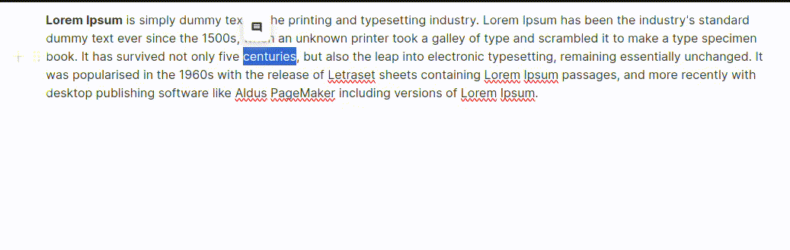

# EditorJS Drag/Drop Plugin


Comments feature for [Blocknote](https://www.blocknotejs.org/).



## Installation

### Install via YARN

Get the package

```shell
$ yarn add @defensestation/blocknote-comments
```


## Usage

Include module at your application

```javascript
import {
  commentStyleSpec,
  CommentToolbarController,
  CreateCommentButton,
} from "@defensestation/blocknote-comments";
```

Create schema with comment style spec.
```javascript
const schema = BlockNoteSchema.create({
  styleSpecs: {
    // Adds all default styles.
    ...defaultStyleSpecs,
    // Adds the Font style.
    comment: commentStyleSpec,
  },
});
```

Add comment button in toolbar.
```javascript
const CustomToolbar = () => (<FormattingToolbarController
          formattingToolbar={() => (
            <FormattingToolbar>
              <CreateCommentButton key={"createCommentButtin"} />
            </FormattingToolbar>
          )}
        />)
```

Add comment controller.
```javascript
<BlockNoteView formattingToolbar={false} editor={editor}>
    <CustomToolbar />
    <CommentToolbarController />
</BlockNoteView>
```


## Demo

[A demo is worth a thousand words](https://codesandbox.io/p/devbox/blocknote-comments-lz4gx5?layout=%257B%2522sidebarPanel%2522%253A%2522EXPLORER%2522%252C%2522rootPanelGroup%2522%253A%257B%2522direction%2522%253A%2522horizontal%2522%252C%2522contentType%2522%253A%2522UNKNOWN%2522%252C%2522type%2522%253A%2522PANEL_GROUP%2522%252C%2522id%2522%253A%2522ROOT_LAYOUT%2522%252C%2522panels%2522%253A%255B%257B%2522type%2522%253A%2522PANEL_GROUP%2522%252C%2522contentType%2522%253A%2522UNKNOWN%2522%252C%2522direction%2522%253A%2522vertical%2522%252C%2522id%2522%253A%2522cluyewi7c00062v6dqech58cz%2522%252C%2522sizes%2522%253A%255B70%252C30%255D%252C%2522panels%2522%253A%255B%257B%2522type%2522%253A%2522PANEL_GROUP%2522%252C%2522contentType%2522%253A%2522EDITOR%2522%252C%2522direction%2522%253A%2522horizontal%2522%252C%2522id%2522%253A%2522EDITOR%2522%252C%2522panels%2522%253A%255B%257B%2522type%2522%253A%2522PANEL%2522%252C%2522contentType%2522%253A%2522EDITOR%2522%252C%2522id%2522%253A%2522cluyewi7c00022v6d4qwortlg%2522%257D%255D%257D%252C%257B%2522type%2522%253A%2522PANEL_GROUP%2522%252C%2522contentType%2522%253A%2522SHELLS%2522%252C%2522direction%2522%253A%2522horizontal%2522%252C%2522id%2522%253A%2522SHELLS%2522%252C%2522panels%2522%253A%255B%257B%2522type%2522%253A%2522PANEL%2522%252C%2522contentType%2522%253A%2522SHELLS%2522%252C%2522id%2522%253A%2522cluyewi7c00042v6dd287nj1z%2522%257D%255D%252C%2522sizes%2522%253A%255B100%255D%257D%255D%257D%252C%257B%2522type%2522%253A%2522PANEL_GROUP%2522%252C%2522contentType%2522%253A%2522DEVTOOLS%2522%252C%2522direction%2522%253A%2522vertical%2522%252C%2522id%2522%253A%2522DEVTOOLS%2522%252C%2522panels%2522%253A%255B%257B%2522type%2522%253A%2522PANEL%2522%252C%2522contentType%2522%253A%2522DEVTOOLS%2522%252C%2522id%2522%253A%2522cluyewi7c00052v6dkb38pfsu%2522%257D%255D%252C%2522sizes%2522%253A%255B100%255D%257D%255D%252C%2522sizes%2522%253A%255B50%252C50%255D%257D%252C%2522tabbedPanels%2522%253A%257B%2522cluyewi7c00022v6d4qwortlg%2522%253A%257B%2522tabs%2522%253A%255B%257B%2522id%2522%253A%2522cluyewi7b00012v6duuh2vkau%2522%252C%2522mode%2522%253A%2522permanent%2522%252C%2522type%2522%253A%2522FILE%2522%252C%2522filepath%2522%253A%2522%252Fpackage.json%2522%252C%2522state%2522%253A%2522IDLE%2522%257D%255D%252C%2522id%2522%253A%2522cluyewi7c00022v6d4qwortlg%2522%252C%2522activeTabId%2522%253A%2522cluyewi7b00012v6duuh2vkau%2522%257D%252C%2522cluyewi7c00052v6dkb38pfsu%2522%253A%257B%2522id%2522%253A%2522cluyewi7c00052v6dkb38pfsu%2522%252C%2522activeTabId%2522%253A%2522cluyexn4w006r2v6dxco0yzw1%2522%252C%2522tabs%2522%253A%255B%257B%2522type%2522%253A%2522TASK_PORT%2522%252C%2522taskId%2522%253A%2522Development%2522%252C%2522port%2522%253A5173%252C%2522id%2522%253A%2522cluyexn4w006r2v6dxco0yzw1%2522%252C%2522mode%2522%253A%2522permanent%2522%252C%2522path%2522%253A%2522%252F%2522%257D%255D%257D%252C%2522cluyewi7c00042v6dd287nj1z%2522%253A%257B%2522id%2522%253A%2522cluyewi7c00042v6dd287nj1z%2522%252C%2522activeTabId%2522%253A%2522cluyexk2w005n2v6d50c7xnru%2522%252C%2522tabs%2522%253A%255B%257B%2522id%2522%253A%2522cluyewi7c00032v6d7442entb%2522%252C%2522mode%2522%253A%2522permanent%2522%252C%2522type%2522%253A%2522TERMINAL%2522%252C%2522shellId%2522%253A%2522cluyewj1k000rd9f85w2k2crf%2522%257D%252C%257B%2522type%2522%253A%2522TASK_LOG%2522%252C%2522taskId%2522%253A%2522Development%2522%252C%2522id%2522%253A%2522cluyexk2w005n2v6d50c7xnru%2522%252C%2522mode%2522%253A%2522permanent%2522%257D%255D%257D%257D%252C%2522showDevtools%2522%253Atrue%252C%2522showShells%2522%253Atrue%252C%2522showSidebar%2522%253Atrue%252C%2522sidebarPanelSize%2522%253A15%257D)
